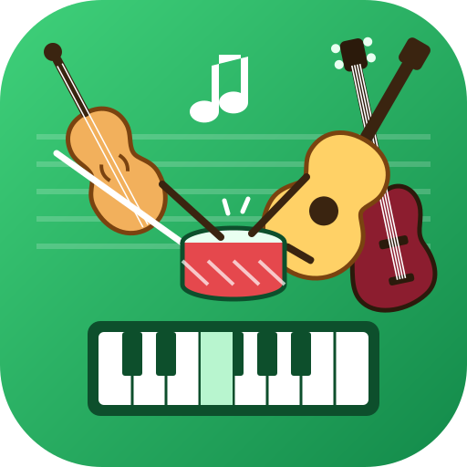

<p align="center"></p>

<h1 align="center">Partoche and Friends</h1>
<p align="center"><b>Une maxi-bibliothèque de partitions MuseScore entre potes.<br>Chacun garde les siennes dans son pCloud, et on bosse les mêmes morceaux ensemble.</b></p>

---

## Le principe

```
 🎻 Membre A         🎹 Membre B        🎸 Membre C
 ☁️ son pCloud       ☁️ son pCloud      ☁️ son pCloud
      │  lien de partage (lecture)  │                │
      └──────────────┬──────────────┴────────────────┘
                     ▼
        📚 la bibliothèque du collectif = l'union de tous les dossiers
        🔔 ntfy.sh : « je suis là », « j'ai changé quelque chose » (chiffré)
```

- **Pas de serveur, pas de base de données.** Chacun écrit **uniquement dans son propre pCloud** ; les autres le lisent par son lien de partage. Rien ne peut être écrasé par quelqu'un d'autre.
- **Le collectif** = une clé secrète + la liste des membres, transmises par un **lien d'invitation**. Chaque membre republie dans son dossier les membres qu'il connaît : celui qui rate une arrivée la découvre au prochain passage (bouche-à-oreille).
- **Temps réel** : comme Partoche, un petit signal passe par le relais public ntfy.sh, mais **chiffré** avec la clé du collectif (AES-GCM) sur un sujet tiré de cette clé.

C'est la suite logique de **[Partoche](https://github.com/soaresden/Partoche)** (élève ⇄ prof) généralisée à N amis, avec l'esprit de **[WeMeetMusik](https://github.com/soaresden/WeMeetMusik)** (bibliothèque commune, qui bosse quoi) — sans MEGA, Supabase ni serveur Replit.

## Ce qu'on peut faire

- 📚 **Bibliothèque commune** : toutes les partitions de tout le monde, regroupées par morceau, recherche, filtre par membre.
- ＋ **Ajouter ses partitions** (`.mscz`) : elles vont dans *son* pCloud, titre et compositeur lus dans le fichier.
- 🔀 **Versions** : « Ajouter ma version » d'un morceau (arrangement, correction, autre tonalité) ; elle reste chez soi et apparaît sous le même morceau.
- 🛠️ **Chantiers** : sur chaque morceau, chacun indique 💡 *envie*, 🛠️ *je bosse dessus* ou ✅ *prêt*, et **sa partie** (« Violon 1 », « main gauche »…). L'onglet *Chantiers* montre ce qui bouge.
- 💬 **Discussion** par morceau.
- ✏️ **Annotations partagées** : chacun annote dans sa couleur (rendu MuseScore fidèle, stylo, surligneur, texte, gomme) ; on voit **un calque par ami**, avec sa bulle, à afficher / masquer. Mises à jour en direct quand l'autre enregistre.
- ▶ **Lecture audio** de la partition (sons FluidR3).
- 🟢 **Présence** : qui est en ligne, et « B est sur ce morceau ».
- 🧪 **Mode démo** sans compte (tout reste dans le navigateur).

## Le dossier pCloud de chaque membre : celui de Partoche

On réutilise **le même dossier** que Partoche (celui partagé avec la prof) : pas de doublon de partitions.

```
Partoche/                (lien de partage + mot de passe, le même que pour la prof)
├── MSCZ/                les partitions : lues telles quelles par Partoche ET par Friends
├── MesNotes/ Settings/ Prof/   Partoche (annotations avec la prof) : jamais touché
└── Friends/
    ├── !Moi.json        profil, collectif, membres connus, mon travail, mes commentaires
    └── Notes/           mes annotations « Friends » : un calque à part de celui de la prof
```

Pas encore de dossier Partoche ? L'appli en crée un (`Partoche/MSCZ`) avec son lien de partage.

Pas à pas (création de l'appli pCloud, configuration de chacun, tablette) : **[le tuto](web/tuto.html)** (page `web/tuto.html`, aussi accessible depuis l'accueil de l'appli). Détails du format et des échanges : [docs/ARCHITECTURE.md](docs/ARCHITECTURE.md).

## Mise en place

**Une seule fois, par toi (pas par chaque membre)** : créer l'appli pCloud sur <https://docs.pcloud.com/my_apps/> (*Redirect URIs* = l'adresse de la page, ex. `https://<compte>.github.io/Partoche-and-Friends/` et `http://localhost:53682/`), copier le *Client ID* dans [`web/config.js`](web/config.js) (`pcloudClientId`), puis publier `web/` sur GitHub Pages.

**Pour chacun**, à l'ouverture de la page :

```
⚙️ Configurer ──┬── ✨ Partir de rien (je crée le collectif)  ─┐
                └── 🔗 J'ai un lien qu'on m'a filé            ─┴─► ☁️ connecter mon pCloud ─► 📁 mon dossier Partoche ─► prénom, emoji ─► 📚
🧪 Mode démo ───────────────────────────────────────────────────────────────────────────────────────────────────► 📚
```

- **Un seul lien pour tout le collectif.** Celui qui crée le collectif clique **🤝 Inviter** et envoie *le même lien* (ou QR code) à tout le monde. Le lien contient, compressés, la clé du collectif et les liens de partage des membres déjà là. Chaque nouveau est ensuite découvert par tous automatiquement : **personne n'écrit de lien entre deux personnes**, même à 4 ou 10.
- Le lien peut aussi être collé sous forme de code `F1.…` (comme le `P1.…` de Partoche). Le bouton *Inviter* de n'importe quel membre donne un lien équivalent.
- **📱 Ajouter un appareil** (*Mon profil*) : déjà configuré sur le PC ? Il affiche un **QR code + un code à 6 chiffres**. La tablette scanne, tape le code, et retrouve tout (pCloud, profil, collectif). Valable 15 min.
- Reconnecter le même pCloud sur un autre appareil marche aussi : le collectif est retrouvé dans `!Moi.json`.

Tester sur PC : double-cliquer sur **`Lancer.bat`** (ou `python -m http.server 53682 --directory web`), la page s'ouvre sur <http://localhost:53682> ; le mode démo marche sans configuration.

## Sécurité, en clair

- Le lien d'invitation (encodé, pas lisible tel quel) contient la clé du collectif et les liens de partage de chacun : **il donne accès en lecture à tous les dossiers**. Ne l'envoyer qu'à des amis.
- Avec **pCloud Premium**, le lien de partage est protégé par un mot de passe aléatoire (transmis dans l'invitation) ; avec un compte gratuit, il n'en a pas, mais il ne circule que dans l'invitation et sur le relais chiffré.
- Pourquoi se connecter à pCloud ? Lire le dossier d'un ami marche avec son lien seul ; mais pCloud refuse toute écriture sans compte connecté (même un lien « dépôt : tout le monde » répond `Please provide 'auth'`). Chaque membre clique donc une fois sur *Connecter mon pCloud* (page officielle pCloud, Google accepté).
- Le jeton pCloud reste dans le navigateur de chacun (localStorage) ; l'appli ne touche qu'au dossier `Partoche and Friends`. *Mon profil → Quitter* l'oublie.
- Le QR code « appareil » contient la connexion pCloud, chiffrée par le code à 6 chiffres affiché à côté (PBKDF2 + AES-GCM) et expire au bout de 15 min. Ne le montrer à personne.

## Développement

- `web/` : l'appli (HTML/JS sans build).
  - `js/app.js` interface · `js/cloud.js` mon espace (pCloud OAuth ou démo) · `js/group.js` collectif, invitation, chiffrement, relais · `js/library.js` bibliothèque fusionnée, versions, chantiers, commentaires, notes · `js/viewer.js` lecteur.
  - `js/partoche/` : briques reprises de Partoche (`score.js`, `audio.js`, `midi.js`, `ink.js` + `setLayers` multi-calques, `pcloud.js` liens publics, `store.js`). `tools/sync-partoche.sh` les remet à jour.
  - `lib/` : webmscore (moteur MuseScore en WebAssembly) fflate, qrcode-generator (MIT).
- Feuille de route : [docs/ARCHITECTURE.md](docs/ARCHITECTURE.md#feuille-de-route).

## Licence

GNU GPL v3 (voir [LICENSE](LICENSE)), comme Partoche et webmscore. Sons : FluidR3 GM (CC BY 3.0). MuseScore est une marque de ses propriétaires ; ce projet n'y est pas affilié.

<p align="center"><sub>Partoche and Friends</sub></p>
