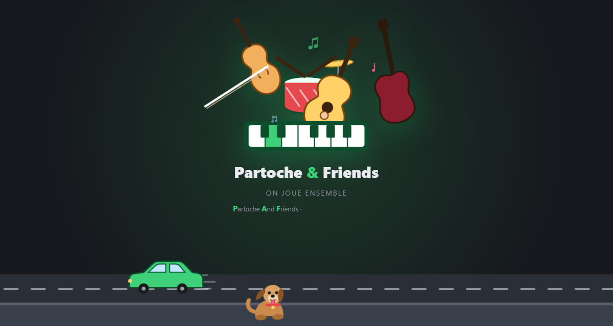

<p align="center"></p>

<h1 align="center">Partoche and Friends · PAF 🐶</h1>
<p align="center"><b>Nos partitions MuseScore dans une seule grande bibliothèque.<br>Chacun garde les siennes dans son pCloud, et on bosse les mêmes morceaux ensemble.</b></p>

<p align="center">
<a href="https://soaresden.github.io/Partoche-and-Friends/"><b>▶ Ouvrir l'appli</b></a> ·
<a href="https://soaresden.github.io/Partoche-and-Friends/tuto.html"><b>📖 Le tuto pas à pas</b></a> ·
<a href="https://github.com/soaresden/Partoche-and-Friends/releases/latest/download/Partoche-and-Friends.apk"><b>📱 L'APK Android</b></a>
</p>

<p align="center"></p>

---

## Le principe

```
 🎻 Membre A          🎹 Membre B          🎸 Membre C
 ☁️ son pCloud        ☁️ son pCloud        ☁️ son pCloud
       │  lien de partage (lecture) │                  │
       └──────────────┬─────────────┴──────────────────┘
                      ▼
        📚 la bibliothèque du collectif = l'union de tous les dossiers
        🔔 relais ntfy.sh chiffré : « je suis là », « j'ai changé quelque chose »
```

- **Pas de serveur, pas de base de données.** Chacun écrit **uniquement dans son propre pCloud**, les autres le lisent par son lien de partage : personne ne peut écraser les fichiers d'un autre.
- **Compatible Partoche** : on réutilise le même dossier que celui partagé avec la prof. Les partitions de `MSCZ/` sont lues telles quelles (aucun doublon) ; Friends n'écrit que dans `Friends/`. Les annotations avec la prof et celles avec les potes sont **deux calques séparés**.
- **Un seul lien d'invitation** (`F1.…`) pour tout le collectif : chaque nouveau est découvert par tous automatiquement, personne ne recopie de lien.

C'est la suite de **[Partoche](https://github.com/soaresden/Partoche)** (élève ⇄ prof) généralisée à N amis, dans l'esprit de **[WeMeetMusik](https://github.com/soaresden/WeMeetMusik)**, sans MEGA, Supabase ni serveur.

## Ce qu'on peut faire

- 📚 **Bibliothèque en tableau** : une ligne par morceau, **une colonne par personne** (💡 envie · 🛠️ je bosse dessus · ✅ prêt, sa partie, 📄 qui a la partition). Clic dans sa colonne pour changer son statut.
- 🎼 **Le lecteur complet de Partoche** : barre de lecture en bas, vitesse 25–150 %, **boucle A–B**, curseur qui suit la musique, pistes (afficher, muet, solo, volume, **instrument par partie**), noms des notes (A B C / Do Ré Mi), 4 mises en page, zoom, accordeur.
- ✏️ **Annotations partagées** : stylo à pression, surligneur, texte, gomme, formes, emojis… chacun dans sa couleur, **un calque par ami** à afficher ou masquer, mis à jour en direct.
- 💬 **Chat dans la partition**, à droite : un fil par morceau.
- ＋ **Ajouter ses partitions** (`.mscz`) et **📥 copier chez soi** celle d'un pote.
- 🎨 **Profil** : prénom, emoji, couleur. La couleur devient le **thème de toute l'interface**.
- 👑 **Admin** (créateur du collectif) : peut retirer un membre.
- 🔁 **Nouvel appareil sans rien refaire** : connecter son pCloud suffit (le profil est retrouvé dans `Friends/!Moi.json`), ou **QR code + code à 6 chiffres** depuis un appareil déjà configuré.
- 🟢 **Présence** : qui est en ligne, « X est sur ce morceau ».
- 🧪 **Mode démo** sans compte.

## Le dossier pCloud de chaque membre

```
Partoche/                (même lien, même mot de passe que pour la prof)
├── MSCZ/                les partitions : lues par Partoche ET par Friends
├── MesNotes/ Settings/ Prof/   Partoche : jamais touché
└── Friends/
    ├── !Moi.json        profil, collectif, membres connus, statuts, chat
    └── Notes/           mes annotations « Friends » (une par partition et par vue)
```

## Mise en place

Tout est expliqué pas à pas dans **[le tuto](https://soaresden.github.io/Partoche-and-Friends/tuto.html)** (`web/tuto.html`). En bref :

1. **Une seule fois, par une seule personne** : créer une appli sur <https://docs.pcloud.com/my_apps/>. *Redirect URIs* : `https://soaresden.github.io/Partoche-and-Friends/` (et `http://localhost:53682/` pour tester sur le PC). *Allow implicit grant* : **Allow**. ⏳ La validation par pCloud peut prendre jusqu'à 2 jours.
2. **Chacun** ouvre l'appli → ⚙️ Configurer → ✨ partir de rien ou 🔗 lien reçu → ☁️ connecter son pCloud → 📁 son dossier Partoche → son profil.
3. **🤝 Inviter** : le même lien pour tout le monde. Le Client ID voyage dedans, les invités n'ont rien à taper.

Le Client ID n'est pas dans le dépôt : sur un PC, il va dans `web/config.local.js` (ignoré par git) ; sinon l'appli le demande ou le reçoit par l'invitation.

**Tester sur le PC** : double-cliquer sur `Lancer.bat` (Python requis), puis ouvrir <http://localhost:53682/>.

## Sécurité, en clair

- Le lien d'invitation (encodé, pas lisible tel quel) contient la clé du collectif et les liens de partage des membres : **il ouvre en lecture les dossiers de tous les membres**. Ne l'envoyer qu'à des amis.
- Écrire dans pCloud exige d'être connecté (même un lien « dépôt : tout le monde » répond `Please provide 'auth'`) : chacun clique une fois sur *Connecter mon pCloud* (page officielle pCloud, Google accepté). Le jeton reste dans le navigateur.
- Le QR code « appareil » est chiffré par le code à 6 chiffres affiché à côté et expire au bout de 15 min.
- Le relais ntfy.sh ne voit que des messages chiffrés (AES-GCM, clé du collectif).

## Développement

- `web/` : l'appli (HTML/JS sans build), publiée sur GitHub Pages à chaque push (`.github/workflows/pages.yml`).
  - `js/app.js` interface · `js/cloud.js` mon espace pCloud (OAuth) ou démo · `js/group.js` collectif, invitation, chiffrement, relais · `js/library.js` bibliothèque fusionnée, statuts, chat, notes · `js/viewer.js` lecteur complet.
  - `js/partoche/` : briques reprises de Partoche (`score.js`, `audio.js`, `midi.js`, `ink.js` + calques d'amis, `pcloud.js`, `store.js`, `tuner.js`).
  - `lib/` : webmscore (moteur MuseScore en WebAssembly), fflate, qrcode-generator.
- `android/` : coquille WebView qui ouvre l'appli en ligne (toujours à jour). L'APK est fabriqué et publié par `.github/workflows/apk.yml`. Clé de signature : secrets GitHub + copie locale `android/keystore/` (ignorée par git, **à sauvegarder**).
- Architecture et feuille de route : [docs/ARCHITECTURE.md](docs/ARCHITECTURE.md).

## Licence

GNU GPL v3 (voir [LICENSE](LICENSE)), comme Partoche et webmscore. Sons : FluidR3 GM (CC BY 3.0). MuseScore est une marque de ses propriétaires ; ce projet n'y est pas affilié.
